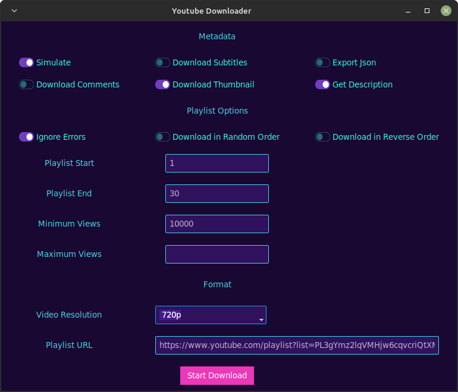

# [YT-DLP GUI]

## Table of Contents

- [Description](#description)
- [Installation](#installation)
- [Usage](#usage)

## Description

YT-DLP GUI is a graphical user interface (GUI) application for downloading YouTube videos and playlists using the yt-dlp library. This user-friendly tool allows users to customize their download preferences, including metadata, subtitles, comments, thumbnail, and more. It also provides options for setting playlist parameters such as start, end, minimum views, and maximum views. Users can choose their desired video resolution before initiating the download process.

## Installation

1. Clone this repository:

git clone https://github.com/khaled-ashraf-dev/yt-dlp-gui.git

2. Install the required dependencies:

pip install yt-dlp ttkbootstrap

3. Run the application:

python main.py

## Usage

1. Launch the application by running `main.py`.
2. Configure your download preferences, including metadata, subtitles, comments, thumbnail, and more, using the provided checkboxes.
3. Set playlist parameters such as start, end, minimum views, and maximum views.
4. Choose your desired video resolution from the dropdown menu.
5. Enter the YouTube playlist URL in the text field.
6. Click the "Start Download" button to initiate the download process.

